🧠 RAG-Powered PDF Chatbot
Ask questions directly from your uploaded PDFs — with authentication, Google login, and persistent memory!

🚀 Overview
This project is a Retrieval-Augmented Generation (RAG) chatbot built using FastAPI, LangChain, ChromaDB, and OpenRouter LLMs.
Each user can upload PDFs, and the system automatically:
    1.Extracts and chunks content 🧩
    2.Generates embeddings 🧠
    3.Stores them in a persistent Chroma vector database
    4.Lets users ask natural questions about their own documents 💬

✨ Features
✅ User Authentication (JWT-based)
✅ Google OAuth Login
✅ Individual User Folders (isolated document storage)
✅ Automatic Chunking + Embedding for new uploads
✅ RAG-based Q&A
✅ Chat session history stored in MongoDB
✅ Background processing of uploads
✅ Debug endpoints for vector inspection

🏗️ Tech Stack
| Layer            | Tools                                                  |
| ---------------- | ------------------------------------------------------ |
| **Backend**      | FastAPI, LangChain                                     |
| **Vector Store** | ChromaDB                                               |
| **LLM**          | OpenRouter API (BGE-Large embeddings + any chat model) |
| **Database**     | MongoDB                                                |
| **Auth**         | JWT + Google OAuth2                                    |
| **Frontend**     | React (optional, if integrated)                        |
| **Deployment**   | Uvicorn / Gunicorn                                     |

⚙️ Project Structure

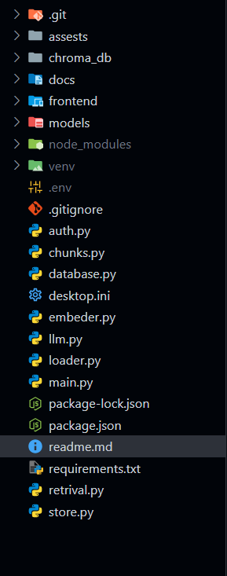

🧩 How It Works
1️⃣ Upload Document
Each authenticated user can upload PDFs to:
POST /upload/{username}

The file is saved to:
docs/{username}/{file_name}.pdf

2️⃣ Background Processing
As soon as a PDF is uploaded:
1.The backend extracts text
2.Splits it into chunks
3.Generates embeddings
4.Stores them in chroma_db/
✅ Automatically linked to that user’s data only.

3️⃣ Ask Questions
Once uploaded, users can ask:

POST /ask/{username}
{
  "question": "What is the eligibility criteria in Capital One document?"
}
{
  "answer": "The eligibility criteria mentioned are...",
  "context": ["...text snippet from your PDF..."],
  "session_id": "673ad0..."
}

| Endpoint             | Method | Description                       |
| -------------------- | ------ | --------------------------------- |
| `/api/register`      | POST   | Register a new user               |
| `/api/login`         | POST   | Login with email/password         |
| `/login/google`      | GET    | Google OAuth login                |
| `/upload/{username}` | POST   | Upload a PDF                      |
| `/ask/{username}`    | POST   | Ask a question from uploaded docs |
| `/debug_chroma`      | GET    | Inspect vector DB                 |
| `/api/sessions`      | GET    | Get all chat sessions             |

Home Page
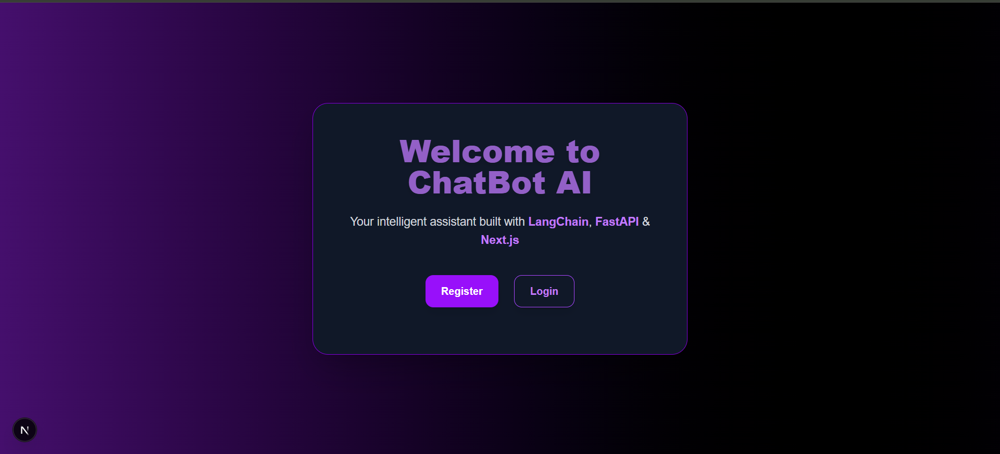

Registration Page

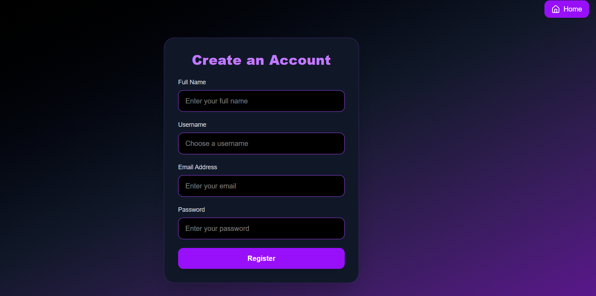

Sucessfull Registration 

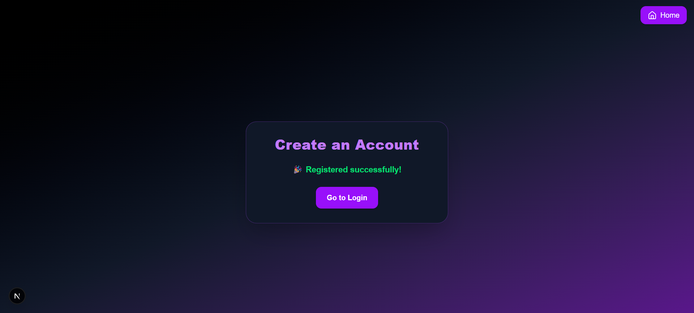

Login Page

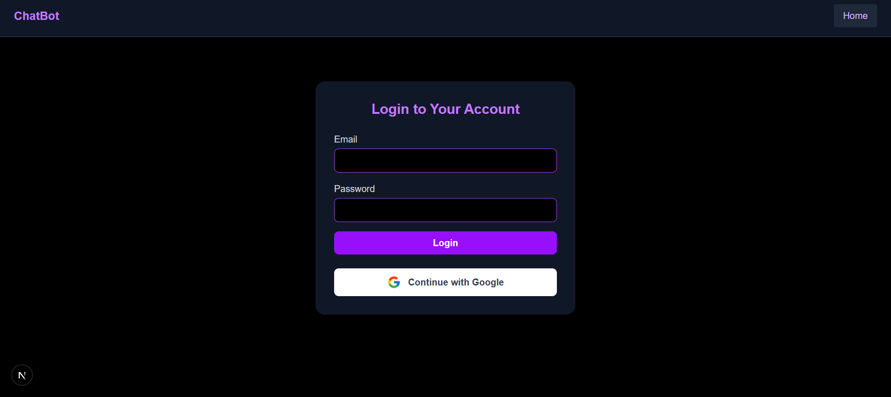

Google Auth

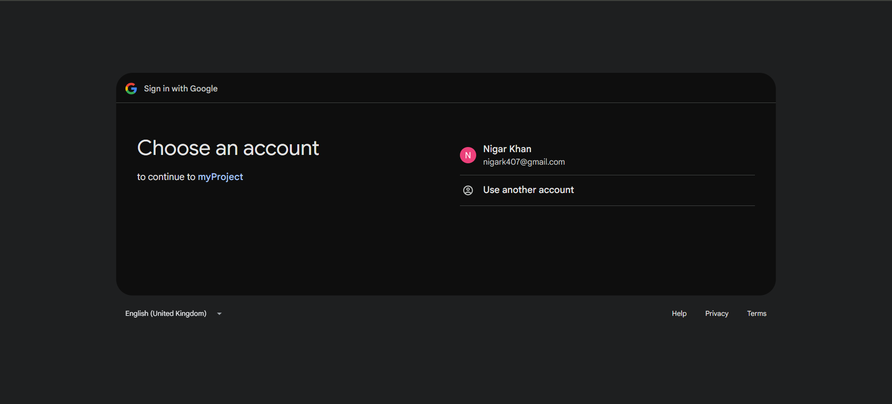

Uploading Page

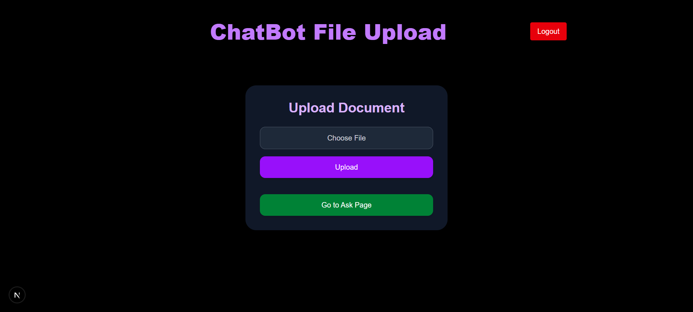

Chat Bot Home Page
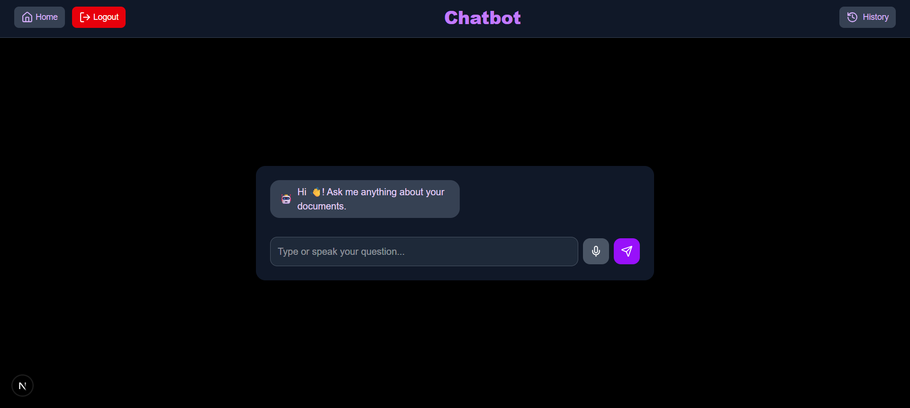
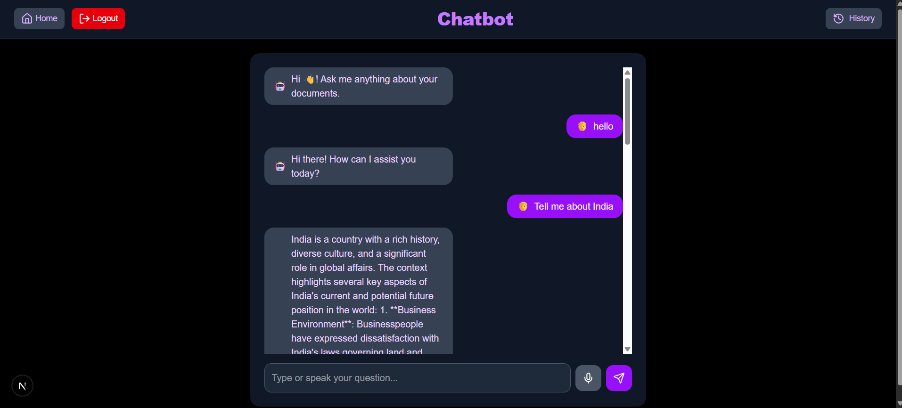
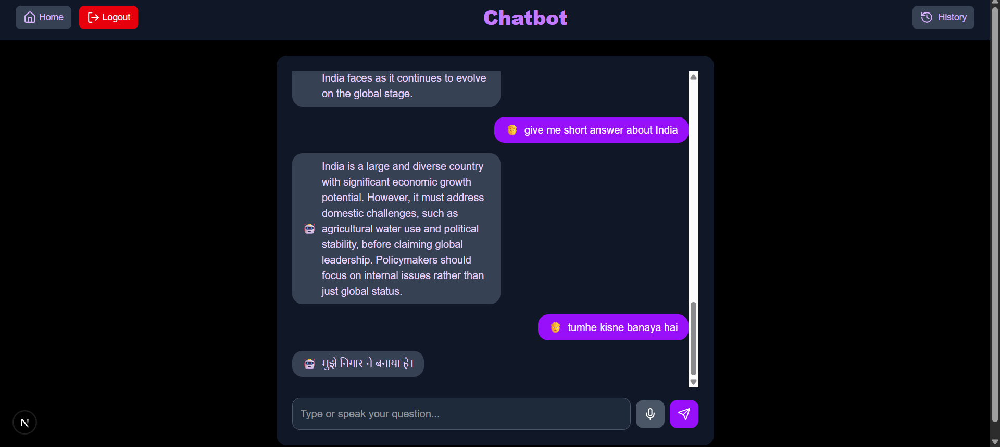
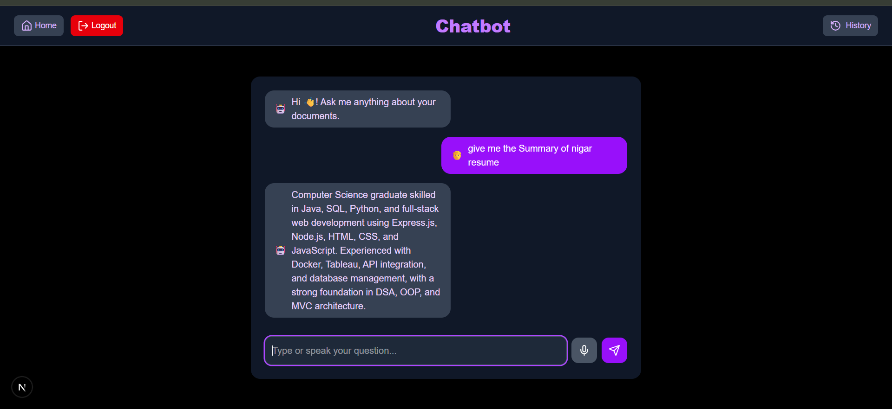
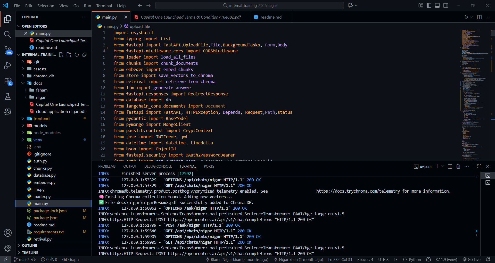

MongoDB Storage

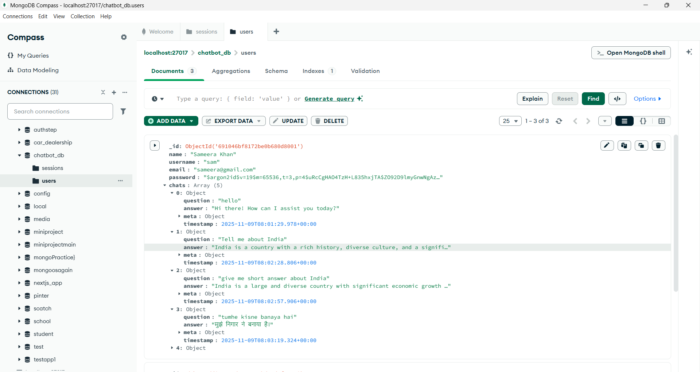

🧩 Future Improvements

 Streamed responses from LLM
 Per-user vector namespaces
 WebSocket-based live chat
 File type expansion (TXT, DOCX, XLSX)

❤️ Credits

Developed by Nigar khan

📜 License
MIT License © 2025 Nigar khan